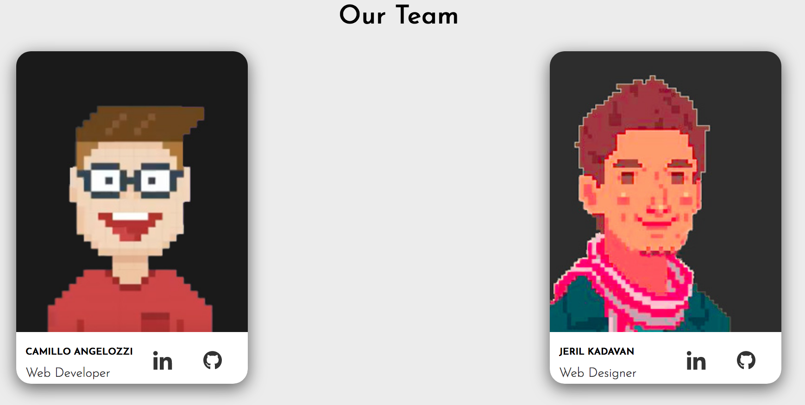
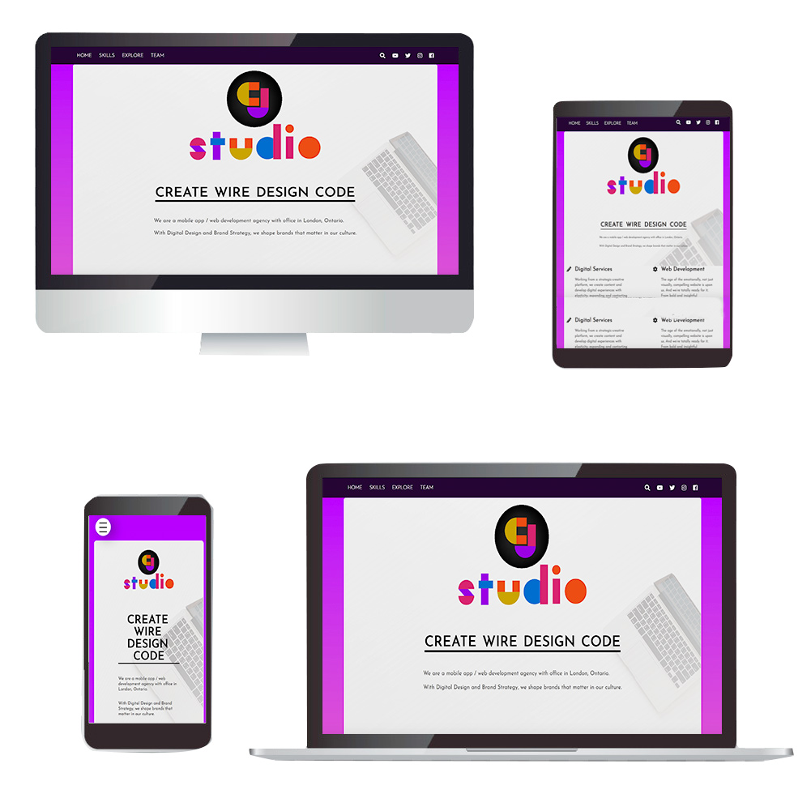

# Agency X 
*aka CJ Studio*





### PRODUCTION
- download repository 
- open Terminal adn type:
```
gulp serve
```


### DEVELOPMENT

To run in Dev mode:
```
npm run dev
```


Two Gulp tasks have been created:
- 'gulp watch' will take care about SASS compiling to CSS and continously looking for changes.
- 'gulp serve' will start *Browsersync* and run the site at loaclhost:3000

Both gulp tasks have been added to a npn script to run sequentially:

```
  "scripts": {
    "dev": "gulp watch & gulp serve"
  },
```

### Project Ouline

- Authoring 2 HW 1
- Gulp, SASS and Javascript Objects

Prototyping and building a 1-page app that describes team members and showcases the work done together.

### Giving credits for places that helped to do this project

- https://github.com/dianadi09/pureJSLightbox
- http://getbem.com/introduction/
- https://sass-lang.com/

### Future Improvements
- Team Members Class constructor to handle more job positions beside Developer and Designer
- Continue using BEM method for HTML/CSS structure
- Move Members Profiles details and Agency skills from JS objects to a Backend structure using Database.